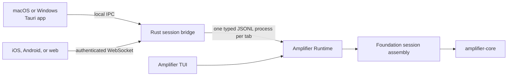

# Amplifier Studio

Amplifier Studio is a Tauri 2 application targeting Windows, macOS, Android,
and iOS, plus a browser client. The currently proven v0.1 product is the local
macOS app and authenticated loopback browser client; Windows and mobile remain
release-gated as documented below. Studio keeps
multiple Amplifier sessions alive in parallel without embedding or
reimplementing the Python agent runtime.

Studio and the terminal UI are peer clients of the neutral
[`amplifier-runtime`](https://github.com/michaeljabbour/amplifier-runtime)
session host. Studio has no executable or package dependency on the TUI.

The project is MIT licensed. The current release truth, including mobile,
security, runtime-installation, and signing gates, is maintained in
[`docs/RELEASE-READINESS.md`](docs/RELEASE-READINESS.md).

The interface is SolidJS inside each platform's native Tauri WebView. All app
and bridge logic is Rust. Every live tab attaches to one out-of-process
`amplifier-runtime serve --attachable` process on its selected host.
Network-owned runtimes are detached owners: client and host-daemon restarts
do not stop them.

## Runtime topology



Desktop apps run the Rust `SessionManager` in-process and spawn the Python
runtime locally. Mobile operating systems cannot host an arbitrary Python
child executable, so the native iOS and Android shells connect to the same
Rust manager on a desktop/server host. `src/transport.ts` is the only place
that chooses between Tauri IPC and WebSocket; the reducer and interface are
identical on every target.

The bundled Rust web host binds only to `127.0.0.1` in v0.1. A physical mobile
device therefore needs an authenticated TLS tunnel or reverse proxy in front
of that loopback service. Configure its HTTPS URL using the gear button in the
app, or provide `VITE_STUDIO_BRIDGE_URL` at build time. Do not expose the
bridge directly to a network; approvals and filesystem-capable agent requests
cross this boundary.

The recommended private mobile setup is Tailscale Serve on the runtime host:

```sh
tailscale serve --bg 4317
```

Point Studio at the resulting `https://<host>.<tailnet>.ts.net` URL and allow
that exact origin in `amplifier-host`. Every iPhone using this private endpoint
must have Tailscale installed, signed into an authorized tailnet identity, and
connected. If phones must connect without Tailscale, use a hardened public
HTTPS reverse proxy or Tailscale Funnel instead; Funnel makes the endpoint
public, so keep Studio's bearer authentication and strict origin allowlist in
place.

## Implemented product surface

- Parallel sessions in independent native tabs
- Responsive phone, tablet, and desktop layouts with safe-area handling
- Boot progress, elapsed phase labels, streamed response tails, and durable
  thinking/transcript blocks (including honest provider-withheld placeholders)
- Tool calls correlated only by `tool_call_id`
- Approval and deferred-decision bars
- Amplifier-owned default `auto` posture; mode flags are sent only when the
  user explicitly chooses an override
- Mid-turn steering with the runtime's 32-item queue bound
- Per-tab interrupt and graceful child shutdown
- Context, cost, model, mode, effort, and one lane per subagent, including
  concurrent child tools correlated by `tool_call_id`
- A persistent Steps surface that folds real `todo` tool activity into the
  coordinator and each child-agent plan, including failed and replayed steps
- An execution Map that renders Attractor's durable DOT graph and live node
  transitions; ordinary sessions receive an evidence-only lifecycle map
- A persistent Coordinator chat in the center with clickable agent workspaces,
  run/build/output/context inspectors, and live per-agent timelines
- Installed bundle and provider discovery through the Rust bridge; selecting a
  different composition opens an isolated sibling runtime without stopping the
  current machine
- Active-session Autopilot: it continues an idle coordinator or steers the
  coordinator's current turn, and never creates a replacement session
- An outcome-first capability library for Coordinator, Browser Use, Computer
  Use, built-in Terminal Use, Imagen, and Attractor, grounded in Amplifier's canonical
  `MODULES.md` catalog; app control remains a capability of the active runtime
- Typed output capture for concrete file, image, diagram, and dataset paths
  returned by tools
- Bounded microphone speech-to-text into an editable draft. On desktop Studio uses
  this computer's existing `OPENAI_API_KEY` (environment or `~/.amplifier/keys.env`)
  with `gpt-transcribe`, falling back to the runtime host only when there is no local
  key; mobile and browser clients always use the host. It never creates or overwrites
  a key, and never submits the resulting text automatically.
- Recoverable setup conditions (such as a missing stored bundle) live in the
  machine inspector instead of masquerading as chat messages
- Read-only all-project session drawer with project-path recovery for TUI/CLI
  sessions and safe resume/reattach
- Friendly errors for resume exit codes 2, 3, and 4
- Named runtime-host registry shared with the TUI, per-tab host selection,
  remote project browsing, HTTPS connections, visible host badges, and a
  selectable **Session home** for default compute and durable history
- Versioned `/v1/` REST/WebSocket envelopes plus Runtime capability negotiation
- Authenticated remote output download and redacted durable settings parity
- Generated Windows `.ico`, macOS `.icns`, Android, and iOS icon sets
- Signed desktop update discovery and install/restart through GitHub Releases
- Tool-contract safety gates that keep known-corrupt experimental RunPod
  routes out of executable Amplifier sessions while retaining checked matrix
  routes and explicit text-only experiments in the installer

## Desktop development

Requirements are Node 22+, Rust 1.77+, and an `amplifier-runtime` installation.
The bridge checks `~/.local/bin` before `PATH`, or uses the exact executable set
through `AMPLIFIER_STUDIO_RUNTIME_BIN`.

```bash
npm install
npm run tauri dev
```

For an isolated native macOS QA bundle that cannot replace an installed
release, run `npm run macos:build:peer-qa`. It uses a separate bundle
identifier and app name, plus the same stable Developer ID identity as the
release build so rebuilt QA apps keep macOS privacy and Keychain grants.

Build the native package for the current desktop platform:

```bash
npm run tauri -- build
```

The macOS overlay titlebar is platform-specific. Windows uses normal native
window chrome. Platform configuration lives in `src-tauri/tauri.*.conf.json`.

## Web demonstration

Build the SolidJS client and serve it from the Rust bridge:

```bash
export AMPLIFIER_HOST_TOKEN="$(openssl rand -hex 32)"
export AMPLIFIER_HOST_ALLOWED_PROJECT_ROOTS="$PWD"
npm run web:serve
```

Then open <http://127.0.0.1:4317>, open Bridge settings, and enter the token.
The browser uses an authenticated WebSocket path and can start real Amplifier
sessions. Project execution is default-deny and every
allowed root is canonicalized before use. For split development, allow Vite's
exact origin and run the bridge and client separately:

```bash
export AMPLIFIER_HOST_TOKEN="$(openssl rand -hex 32)"
export AMPLIFIER_HOST_ALLOWED_PROJECT_ROOTS="$PWD"
export AMPLIFIER_HOST_ALLOWED_ORIGINS="http://127.0.0.1:1420"
npm run web:bridge
npm run dev
```

The token may instead come from `--token-file PATH`. A remote client must use
an authenticated TLS tunnel or reverse proxy; the included host remains
loopback-only.

## Remote host

The neutral Rust entry point is `amplifier-host`; the older
`amplifier-studio-server` name remains only as a compatibility alias. A host
can create its token and configuration and start in the foreground with one
command:

```bash
amplifier-host enable \
  --allow-project-root /home/amplifier/dev \
  --default-project-root /home/amplifier/dev \
  --origin https://sam-lab.example.ts.net
```

The allowed root is the highest directory Studio may browse; choose the shared
workspace parent rather than one existing repository. The default root is where
the project picker opens. If neither project-root option is supplied,
`amplifier-host enable` creates and uses `~/dev`. The authenticated Studio picker
can create a new project folder inside that boundary, but it cannot broaden the
host allowlist.

`amplifier-host status` reports the redacted configuration and
`amplifier-host token rotate` replaces the bearer token. The listener always
refuses non-loopback binds; put Tailscale Serve, an SSH tunnel, or an
authenticated TLS reverse proxy in front of it. Provider credentials stay on
the host. Client-side known endpoints live in `~/.amplifier/hosts.yaml`, while
tokens are referenced, never stored, in that registry. A `keychain:` reference
resolves to the macOS Keychain, the Windows Credential Manager, or -- on Linux,
where a headless compute host usually has no D-Bus session for a Secret Service
to answer on -- a `0600` file under `$AMPLIFIER_HOME/credentials`. Studio
creates that directory `0700`; note it does not narrow an `~/.amplifier` that an
earlier build already created world-readable.

Studio promotes a remote endpoint into the compute pool only after it has
successfully started a session. In **Settings → Connection**, choose any saved
host as **Session home**. New sessions then start on that host by default and
the history drawer reads that host's durable session library. Existing
sessions remain where they were created; Studio does not claim to migrate or
replicate them between hosts. On ephemeral compute, point `AMPLIFIER_HOME` at
persistent storage before relying on that host as a session home.

Each remote Studio tab is pinned to a `(host, session-id)` pair. Closing or
reopening the Studio client only detaches its authenticated socket: the host
and Python owner keep running, and the client reattaches with replay. The Rust
host process itself must remain available for live reattachment; after a host
restart, stored resume is the current recovery floor. Set `AMPLIFIER_HOME` to
persistent storage on ephemeral VMs or pods if stored sessions must survive
replacement of the compute instance itself.

Release and operations checks can exercise that contract without exposing the
host token on the command line:

```bash
export AMPLIFIER_HOST_TOKEN="$(security find-generic-password -w -s amplifier-host -a my-host)"
uv run --script scripts/remote-host-continuity.py \
  --url https://my-host.example.ts.net \
  --project-dir /srv/amplifier/projects/demo \
  --provider anthropic \
  --model claude-opus-5
```

The check submits a real Studio protocol turn, drops the client connection
after Amplifier accepts the prompt, waits offline, reattaches to the same
runtime, replays the missed records, and requires a completed model response.

For development against a specific runtime checkout, set
`AMPLIFIER_STUDIO_RUNTIME_BIN` to the exact compatible executable. Packaged
builds otherwise resolve only `amplifier-runtime`, first in `~/.local/bin` and
then on `PATH`.

## Android

Initialize once and build an APK/AAB through Tauri:

```bash
export ANDROID_HOME="$HOME/Library/Android/sdk"
export JAVA_HOME="/Applications/Android Studio.app/Contents/jbr/Contents/Home"
export NDK_HOME="$ANDROID_HOME/ndk/27.2.12479018"
export PATH="$HOME/.cargo/bin:$PATH" # use rustup's Android stdlib targets
npm run android:init -- --ci
npm run android:build -- --debug --target aarch64 --apk
```

The generated Android Studio project is under `src-tauri/gen/android`. Use
`npm run android:dev` for an attached device or emulator. Set the bridge URL
from the app's gear button before starting a session.

## iOS

On macOS with Xcode, CocoaPods, and an installed iOS Simulator runtime:

```bash
npm run ios:init -- --ci
npm run ios:dev
# or
npm run ios:build -- --target aarch64 --ci
```

The generated Xcode project is under `src-tauri/gen/apple`. App Store/device
builds still require the normal Apple signing team and provisioning setup.

## Validation

```bash
npm run build
npm test
cd src-tauri
cargo fmt --check
cargo test --all-targets
cargo check --all-targets
```

The browser-to-runtime pipe can be checked without consuming a model turn:
connect to `/api/session/<gui-id>`, send a `start` message, wait for
`session.started`, send `context.get`, then send `stop`.

## Inline visual artifacts

Coordinator Markdown can include explicit `amplifier-dot`, `amplifier-svg`,
and `amplifier-html` fences. Studio renders DOT locally, sanitizes static SVG,
and gives HTML a unique-origin sandbox with no network or Tauri access. That
sandbox inherits Studio's CSP, so artifact markup renders but author JavaScript
does not run; see `docs/INLINE-VISUALIZATION-PROTOCOL.md`. Incomplete visual fences collapse into a small composing state while
the model streams, so raw HTML never floods the conversation. Ordinary code
fences stay code. The complete authoring and security
contract is in [`docs/INLINE-VISUALIZATION-PROTOCOL.md`](docs/INLINE-VISUALIZATION-PROTOCOL.md).

## Publishing releases

A matching `studio-vX.Y.Z` tag fans out into three independently visible
GitHub workflows:

- `.github/workflows/publish.yml` builds the signed and notarized Apple Silicon
  desktop app plus the Authenticode-signed Windows installers, then publishes
  one GitHub Release and cross-platform `latest.json` updater feed;
- `.github/workflows/ios-testflight.yml` builds an App Store IPA, validates and
  uploads it with Apple's API key, waits for processing, and assigns it to the
  configured TestFlight group;
- `.github/workflows/android-release.yml` builds and verifies the signed AAB,
  obtains a short-lived Google credential through GitHub OIDC, and commits the
  bundle to the configured Google Play testing track.

Published desktop builds check `latest.json` after launch and show an
**Update _version_** control when a newer complete desktop release exists.
Updates never interrupt an active turn; the control enables after running turns
finish or are interrupted. Mobile updates remain store-owned.

The updater public key is committed in `src-tauri/tauri.conf.json`. Its
passwordless private counterpart was generated locally at
`~/.tauri/amplifier-studio.key`; keep it private and back it up. Before the
first release, create a GitHub Actions secret named
`TAURI_SIGNING_PRIVATE_KEY` containing that file's contents. The optional
`TAURI_SIGNING_PRIVATE_KEY_PASSWORD` secret may remain empty for this key.

macOS releases must also be signed with a stable Developer ID identity. An
ad-hoc development signature is tied to a single build's code hash, so macOS
can treat every rebuilt app as a new application and repeat Files & Folders
consent prompts. On a Mac with a Developer ID Application certificate in the
login keychain, build a signed package with:

```bash
npm run macos:build:signed
```

The script discovers the certificate without committing a developer-specific
identity to this open-source repository. `APPLE_SIGNING_IDENTITY` can override
the selection. GitHub's protected `release` environment holds:

- `APPLE_DEVELOPER_ID_CERTIFICATE_BASE64` and optional
  `APPLE_DEVELOPER_ID_CERTIFICATE_PASSWORD` for desktop signing;
- `APPLE_DISTRIBUTION_CERTIFICATE_BASE64` and optional
  `APPLE_DISTRIBUTION_CERTIFICATE_PASSWORD` for an iOS PKCS#12 bundle that
  contains both Apple Development and Apple Distribution identities (Tauri
  development-signs the device build before the App Store export re-signs it);
- `APPLE_KEYCHAIN_PASSWORD`, `APP_STORE_CONNECT_API_KEY_ID`,
  `APP_STORE_CONNECT_ISSUER_ID`, and `APP_STORE_CONNECT_API_PRIVATE_KEY`;
- `IOS_PROVISIONING_PROFILE_BASE64` plus the non-secret, comma-separated
  `IOS_TESTFLIGHT_GROUPS` environment variable.

The App Store Connect key replaces Apple-ID passwords in CI and is shared by
macOS notarization and TestFlight delivery.

Windows uses the Microsoft Store MSIX channel so the Store supplies its public
signature and updates without a paid Azure signing subscription. Copy the exact
Partner Center Product identity values into the protected `release` environment
variables `WINDOWS_STORE_IDENTITY_NAME`, `WINDOWS_STORE_PUBLISHER_ID`, and
`WINDOWS_STORE_PUBLISHER_DISPLAY_NAME`, then run **Build Windows Store
package**. The resulting unsigned MSIX is only for Store upload, not sideloading.

Android signing uses `ANDROID_UPLOAD_KEYSTORE_BASE64`,
`ANDROID_UPLOAD_KEYSTORE_PASSWORD`, `ANDROID_UPLOAD_KEY_ALIAS`, and
`ANDROID_UPLOAD_KEY_PASSWORD`. Google access does not use a JSON key: the
`GOOGLE_PLAY_WORKLOAD_IDENTITY_PROVIDER` and `GOOGLE_PLAY_SERVICE_ACCOUNT`
environment variables identify a workload identity restricted to this
repository's release tags. The service account must also be granted app access
inside Google Play Console.

To publish, update the version in `package.json`, `src-tauri/Cargo.toml`,
`src-tauri/tauri.conf.json`, and the generated iOS `Info.plist`/`project.yml`,
increment the shared mobile build number, then push a matching tag such as
`studio-v0.2.0`. `npm run release:check` rejects marketing-version, tag, and
mobile-build mismatches. The desktop workflow holds a draft GitHub Release
while macOS finishes, generates its `latest.json`, and only then publishes the
release as latest.
`releases/latest/download/latest.json` becomes the update feed only after that
final job succeeds. Production desktop builds check the canonical Amplifier
Studio feed by default; set `VITE_STUDIO_UPDATER_ENABLED=false` for a local or
forked production build that must not check upstream. Development builds leave
updates disabled unless the flag is explicitly set to `true`.

Android, iOS, and Windows updates are store-owned. Tauri's desktop updater is
used only by the directly distributed, signed macOS build.

## Protocol boundary

Rust deliberately does not interpret runtime records. A child stdout line that
parses as a JSON object passes through verbatim on the `record` channel;
stderr and non-JSON stdout become `log` events. The desktop event bus and web
socket both receive the same transport-neutral `SessionEvent`.

The renderer preserves the donor's two-channel rule: live stream events update
only the mutable tail, durable content/tool events create transcript blocks,
and one channel is never reconstructed from the other. Sequenced live records
are checked for gaps. Replayed ledger cursors are exempt.

For resume, the bridge uses `--attach <session-id>`. On Unix this joins a live
owner when present and otherwise resumes storage. The donor gracefully skips
live Unix-socket advertisement on Windows, where stored resume remains
available.

## Coordinator engine direction

The center conversation is intentionally permanent: selecting an agent,
output, bundle, provider, or context view opens it beside the Coordinator chat
instead of navigating away from the conversation that owns the work.

Studio now uses `amplifier-runtime serve` directly for live deltas, approvals,
steering, subagent events, control leases, and durable replay. The TUI consumes
the same published runtime as a peer rather than acting as Studio's engine.
[`amplifier-agent`](https://github.com/microsoft/amplifier-agent) is the
optional active-session Autopilot controller, not a replacement persistence
engine and not a reason to start a second session. The full boundary,
conformance requirements, and safe extraction sequence are documented in
[`docs/RUNTIME-PEER-ARCHITECTURE.md`](docs/RUNTIME-PEER-ARCHITECTURE.md).
