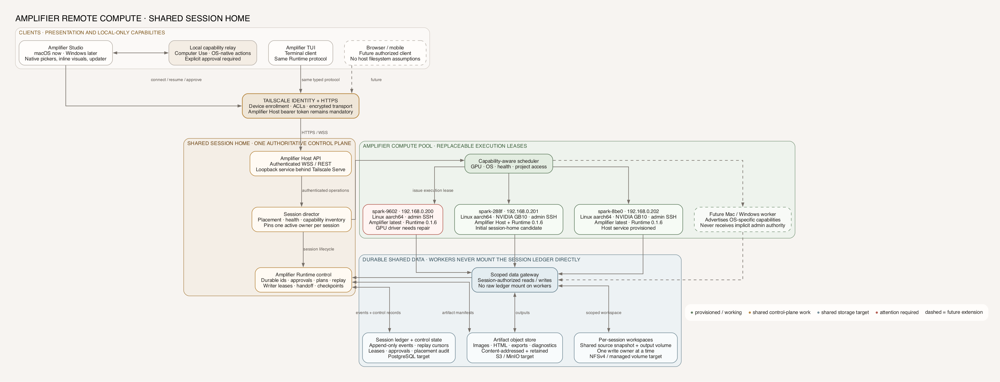

# Amplifier Studio remote runtime architecture

Status: proposed; Phase 0 partially implemented in v0.1.12

## Product model

Studio should use three distinct nouns throughout the interface:

- **Runtime**: the active session's pinned bundle, provider, model, mode, effort,
  runtime version, and execution placement.
- **Machine**: a place capable of running Amplifier: this computer, another
  enrolled computer, or an isolated managed cloud workspace.
- **Capability**: an outcome-oriented composition such as Browser Use, Imagen,
  Attractor, or a bundle discovered from Amplifier's catalog.

The current inspector's **Machine** tab is really a Runtime inspector. It shows
the active composition, and most configuration changes create a separate
runtime because a running turn is pinned. The panel should therefore become:

1. **Runtime**: read-only active composition, current placement, health, spend,
   and a clear `Change for next turn` action when the protocol supports it.
2. **Machines**: local and remote hosts, availability, trust, capabilities,
   latency, cost, and an explicit placement selector.
3. **Capabilities**: the existing Machine Library and Amplifier bundle catalog.

`Start configured sibling` should be renamed `Compare in a new session` and
live in the new-session flow. Provider rows should say `Open with this provider`
rather than looking like they mutate the active session. `Cycle effort now`
belongs beside the effort value in the composer/footer.

## Architecture decision

Treat a session as a durable workflow, not as a process or WebSocket. A process
is an execution lease for an active turn. Between turns the session is durable
state at rest and may consume no compute.

Do not expose the existing loopback bridge to a network. Add a **Studio Host**
daemon that makes an outbound authenticated connection to a control plane.
This avoids inbound firewall configuration and preserves the option for code
and credentials to stay on a user-owned machine.

```text
Native/Web clients
  macOS | Windows | iOS | Android | browser
                    |
             HTTPS / WSS + OIDC
                    |
          Studio control plane
  identity | device registry | policy | placement
  session directory | leases | audit | budgets
                    |
        authenticated relay / event stream
              /                     \
     Personal Studio Host       Managed Workspace
     Mac/Windows/Linux          ephemeral VM/container
              \                     /
             amplifier-runtime serve
                    |
        workspace + tools + provider credentials
```

The control plane schedules and authenticates; it does not need plaintext
workspace content. The data plane carries the existing typed serve records and
operations. Artifacts use a separate content-addressed channel rather than
embedding host filesystem paths in chat records.

## Execution placements

### 1. This computer

The current Tauri-to-Rust-to-`amplifier-runtime serve` path. Best privacy and
lowest setup for macOS/Linux. It remains the default when available.

### 2. My machine

A Studio Host runs on a user's workstation or server. It enrolls through a
one-time device code, receives a device identity, and maintains an outbound
mTLS connection. A phone, browser, or another desktop can operate sessions on
that host without opening a public port.

### 3. Managed cloud workspace

An isolated, short-lived workspace checks out or mounts an authorized project,
obtains scoped secrets from a broker, and runs a versioned Amplifier runtime
pack. It suspends after a clean turn and resumes from the durable event ledger.
The UI must show that code is executing remotely and display the budget before
the first turn.

### 4. Hybrid execution (later)

The coordinator and delegate inference can run remotely while privileged tools
execute through a local, policy-gated tool relay. This preserves local source
control for selected operations, but it should follow the simpler whole-host
placements because it adds distributed transactions and approval complexity.

## Control plane

- OIDC identity, organization, project, and role membership.
- Device enrollment, rotation, revocation, and health heartbeats.
- Logical session directory independent of runtime processes.
- Placement policy using data residency, capability, cost, and availability.
- Single-writer session lease with explicit takeover and audit records.
- Composition registry with immutable bundle/module/provider snapshots.
- Budget, concurrency, retention, and tool policies.
- Append-only audit trail for commands, approvals, placement, and access.

## Data plane and protocol evolution

Keep the existing JSONL normalization boundary. Promote it to a reconnectable
remote contract rather than inventing a second event model.

- `POST /v1/sessions` creates or attaches to a logical session.
- `GET /v1/sessions/{id}` returns authoritative status and placement.
- `WSS /v1/sessions/{id}/events?since=<sequence>` replays, then follows events.
- `POST /v1/sessions/{id}/ops` accepts an operation with actor, lease, and
  idempotency key.
- `POST /v1/sessions/{id}/interrupt` remains scoped to one runtime.
- `GET /v1/sessions/{id}/artifacts/{digest}` returns an authorized artifact or
  a short-lived signed download URL.

Required invariants:

- disconnecting a client does not stop the session;
- every event has a durable sequence and can be replayed from a cursor;
- only the lease holder may mutate a session;
- operations are idempotent across reconnects;
- approvals remain durable, urgent, and answerable from another device;
- a clean between-turn checkpoint can be resumed on another compatible host;
- composition and placement are pinned for a turn and recorded in its audit
  envelope.

The v0.1.12 bridge keeps a child alive when its WebSocket disconnects, replaces
stale attachment leases on reconnect, bounds outbound fan-out, and asks the
runtime to replay from a conservative durable cursor. That supervisor is still
process-local; durable host-restart identity, device principals, lease
heartbeats, and operation idempotency must land before remote access is
production-safe.

## Shared session home and compute pool

The first remote-host milestone keeps each session on the machine where it was
created. A real compute pool needs one additional boundary: clients and workers
share sessions through an authoritative control plane, not by mounting the live
session directory read/write on every worker.

The target design separates three durable data classes:

- an append-only session ledger for events, replay cursors, approvals, writer
  leases, placement, and checkpoints;
- a content-addressed object store for generated artifacts, exports, and
  diagnostics;
- a per-session workspace volume or snapshot with one active write owner.

Workers receive scoped execution leases and publish typed events and outputs
through that plane. A worker can disappear without taking the logical session
with it; another compatible worker resumes only from a recorded clean
checkpoint. This also avoids treating a Unix socket advertised on one Linux
host as though it were reachable from another host through a shared filesystem.

The current three-Spark deployment is an incremental proof of the worker and
transport layers. It does not yet claim cross-host session migration or a
high-availability session database. The proposed control, storage, and worker
boundaries are captured in the rendered architecture:



## Host runtime pack

Desktop and cloud hosts should install a signed, versioned runtime pack rather
than curl-installing a floating Python environment. Its manifest should contain:

- Amplifier host and protocol versions;
- Python/runtime dependencies and hashes;
- supported platforms and architectures;
- bundled default compositions;
- migration and rollback compatibility;
- A/B slots for atomic update and repair.

The Studio shell and runtime pack update independently but negotiate a supported
protocol range. An incompatible host is repaired or rejected before a session
starts.

## Security gates

- TLS everywhere; mTLS for host-to-control-plane connections.
- Short-lived, audience- and session-scoped tokens; no provider keys in the
  browser or Studio control plane.
- Exact Origin validation for browser WebSockets.
- Per-project root allowlists and symlink-safe path enforcement.
- Tool policy with allow/deny/ask modes and durable approval records.
- Encrypted workspace volumes and tenant isolation for managed compute.
- Artifact malware scanning, type validation, hashes, retention, and deletion.
- Rate limits, quotas, cost ceilings, and denial-of-wallet controls.
- User-visible execution placement before every remote turn.
- Audit export, session export/deletion, retention policy, and legal hold hooks.

## Delivery sequence

### Phase 0: make the current bridge reconnectable (partially implemented)

Session lifetime is now separate from a WebSocket and conservative cursor
replay is wired. Add durable host-level attachment identities, per-operation
idempotency, Amplifier lease/heartbeat/takeover controls, and approval handoff.
Keep the host loopback-only.

### Phase 1: personal remote host

Package Studio Host for macOS/Linux, implement outbound enrollment and relay,
and connect iOS/Windows/web clients to a user's own host. This proves remote
operation without taking custody of code.

### Phase 2: managed workspaces

Add immutable runtime images, Git-based workspace provisioning, secret broker,
artifact storage, suspension, quotas, and explicit cost controls.

### Phase 3: placement policy and hybrid tools

Allow local, personal-host, and cloud placement per session or between turns;
then add policy-gated local tool execution only where the trust benefit justifies
the distributed complexity.

## Native publishing gates

### Windows

The repository publishes updater-signed but Authenticode-unsigned x64 MSI and
NSIS evaluation installers with each GitHub desktop release. Before calling
them trusted or release-proven Windows packages:

- choose trusted direct distribution, Microsoft Store distribution, or both;
- configure Authenticode signing for the executable and installers (Azure
  Artifact Signing is the preferred direct-download path; a protected CA-issued
  certificate is the alternative);
- timestamp and verify every signature in CI;
- keep Tauri's updater signature as a separate integrity layer;
- decide whether the first Windows release is remote-host-only or ships a
  tested Windows Amplifier runtime pack;
- add a Windows smoke test for install, launch, WebView2, update, deep link,
  remote-host pairing, resume, and uninstall.

The current Windows shell and PowerShell runtime installer are implemented.
A useful first Windows release still needs a clean-machine install, launch,
WebView2, local runtime, update, resume, and uninstall acceptance run before it
can be called release-proven; remote-host pairing remains an additional path.

### iOS

The generated Xcode project and synchronized product version exist, but this is
not yet an App Store package: its export method is still `debugging`, and this
checkout has no distribution team/provisioning configuration or store CI.

Before TestFlight:

- enroll/confirm the Apple Developer team and register `com.amplifier.studio`;
- create the App Store Connect app record;
- configure Apple Distribution signing and an App Store Connect provisioning
  profile, or use Xcode automatic signing;
- add an App Store export configuration and monotonic build number;
- synchronize the generated iOS version with the release version;
- configure an App Store Connect API key for CI uploads;
- complete icons, launch assets, privacy declarations, export compliance,
  support/privacy URLs, screenshots, and store metadata;
- validate responsive phone/tablet layouts and lifecycle behavior on physical
  devices;
- make remote-host enrollment and HTTPS/WSS authentication the first-run path.

iOS cannot run the Python Amplifier process. Its native value is the trusted,
mobile client experience over the remote runtime architecture above. App updates
ship through TestFlight/App Store rather than Tauri's desktop updater.

## Acceptance criteria for the first remote milestone

- An iPhone can pair to a Mac Studio Host without opening an inbound port.
- Starting a session clearly says `Runs on Michael's Mac` before submission.
- Closing the phone app does not terminate the session or lose an approval.
- Reopening replays from the last event sequence without duplicates.
- A second authorized client can observe; only the lease holder can send ops.
- Revoking the phone immediately prevents reconnect and is audit-visible.
- No project file or provider secret reaches the control plane.
- Generated artifacts can be previewed and downloaded by authorized clients.
- Idle sessions release their worker after a configurable grace period.
