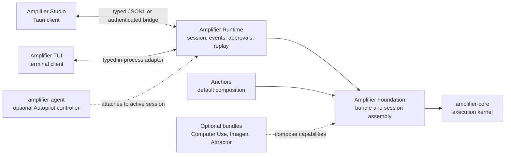

# Runtime peer architecture

Status: accepted direction, incremental migration after Studio 0.1.17.

## Decision

Amplifier Studio and the terminal UI are peer clients of one neutral Amplifier
session runtime. Neither client owns the execution kernel. Studio may use the
existing TUI executable as a compatibility adapter while the UI-free kernel is
extracted, but that adapter is not the target architecture.



The boundaries are deliberately asymmetric:

- `amplifier-core` executes model and tool turns.
- Foundation prepares bundles and creates sessions. It remains mechanism, not
  a desktop product layer.
- Anchors is the opinionated default composition, not a hidden dependency of
  the client.
- the neutral runtime owns durable session identity, event normalization,
  approvals, leases, replay, interruption, and lifecycle.
- Studio and the TUI render the same runtime facts for different interaction
  environments.
- `amplifier-agent` is an optional controller. Autopilot attaches to the
  already-active session; it does not create a replacement session or become
  the persistence layer.

## Packaging and terminology

The neutral host is a Python **package and executable**, not an Amplifier
bundle:

- distribution: `amplifier-runtime`;
- import package: `amplifier_runtime`;
- executable: `amplifier-runtime`;
- default composition: an explicit Anchors bundle reference selected by the
  client or durable settings.

Bundles remain declarative composition: instructions, orchestrator, providers,
tools, hooks, agents, and recipes. The runtime loads those bundles and owns the
process-level behavior around them. Putting serving, persistence, approvals, or
leases inside a bundle would make lifecycle behavior depend on the selected
composition and would prevent a client from safely changing bundles.

The runtime package must not depend on Textual, prompt-toolkit, Rich rendering,
Tauri, SolidJS, or a client product identity. It may depend on
`amplifier-core`, `amplifier-foundation`, Pydantic, Click, YAML, filesystem
locking, and transport-neutral HTTP utilities.

## Language decision

`amplifier-runtime` is a Python host over Amplifier's existing hybrid stack.
Amplifier Core exposes its session, coordinator, hook, approval, and module APIs
through Python and already uses a compiled Rust `abi3` engine internally.
Foundation, bundle preparation, module mounting, and the existing runtime donor
are also Python. Keeping the host at that boundary preserves direct types and
callables instead of introducing an embedded-Python or gRPC boundary inside
every session operation.

Rust remains valuable at the native edge:

- Studio's Tauri process supervisor, updater, signing boundary, and remote
  bridge stay Rust;
- a future authenticated daemon may supervise or isolate Python runtime workers
  in Rust while speaking the same versioned protocol;
- CPU-bound primitives may move into Core's Rust engine when profiling proves a
  need, without changing runtime or client contracts.

The runtime host itself is orchestration and I/O rather than the compute hot
path. Rewriting it in Rust would duplicate the tested TUI donor and require a
new cross-language representation for dynamic Python modules, hooks,
capabilities, approval providers, and Foundation sessions. That cost brings no
current latency or reliability benefit and would delay convergence of the TUI,
CLI, and Studio on one implementation.

## Extraction manifest

The existing TUI kernel is the behavioral donor. Extraction is a move with
temporary import shims, not a rewrite and not a copy into Studio. Every migrated
module has exactly one implementation owner at the end of its increment.

### Neutral runtime owns

```text
amplifier_runtime/
├── host/          session factory, lifecycle, turns, spawn/resume, interruption
├── protocol/      versioned operations, records, JSONL codec, capabilities
├── events/        hook normalization, typed event schema, durable event ledger
├── control/       approvals, decisions, handles, leases, attach, handoff, audit
├── sessions/      identity, transcript, metadata, integrity, relocation, replay
├── policy/        governance, directory boundaries, steering, goals, effort
├── config/        settings resolution, provider/bundle resolution, redaction
├── sdk/           process clients and generated protocol types
└── testing/       offline bundle, fixtures, protocol and two-process harnesses
```

The first donor set from `amplifier-app-tui` is:

- `kernel/serve.py`, `jsonl.py`, `events.py`, and `queue_bridge.py`;
- `kernel/runtime.py`, `session_factory.py`, `session_integrity.py`,
  `session_manager.py`, `session_ops.py`, and `session_transfer.py`;
- `kernel/persistence.py`, `prompt_history.py`, `cost.py`, `context_meter.py`,
  `compaction.py`, `checkpoints.py`, and `rewind.py`;
- `kernel/approval.py`, `question.py`, `session_control.py`,
  `session_authz.py`, `session_attach.py`, and `file_lock.py`;
- `kernel/spawner.py`, `steering.py`, `goal.py`, `governance_hook.py`,
  `safety.py`, `directory_permissions.py`, and the runtime trackers;
- the runtime-facing portions of `kernel/config.py`, `settings_service.py`,
  bundle resolution, provider resolution, source locking, and notifications;
- semantic model types used by that boundary: queues, trust, turns, evidence,
  configuration state, redaction, and protocol-safe transcript/event blocks;
- the Python and TypeScript JSONL SDKs plus their protocol validators.

Extraction should split current product coupling instead of moving it intact:

- `product.py` labels become injected host metadata rather than runtime
  constants;
- TUI `model.blocks.UnsupportedBlock` becomes a protocol-owned
  `unsupported_event` record, so normalization does not import presentation
  types;
- the packaged `tui` bundle stays with the TUI. Runtime accepts a bundle URI or
  resolved durable default and does not silently imply TUI composition;
- runtime update/doctor/settings commands report the runtime distribution;
  TUI update commands report the TUI distribution.

### Terminal UI keeps

- Textual widgets, reducer, transcript rendering, themes, keymap, layout,
  command palette, terminal capability probes, and native terminal input;
- the full-screen settings editor and other presentation controllers;
- a thin in-process adapter implementing the same client contract as JSONL;
- TUI product installation and update policy.

The TUI's `amplifier_app_tui.kernel.<moved_module>` compatibility package path
resolves only to the installed `amplifier_runtime` implementation. Its duplicate
local modules are not executable fallbacks.

### Reference CLI keeps

- prompt-toolkit/Rich composition, terminal input routing, transcript rendering,
  key handling, clipboard interaction, and CLI-specific commands;
- `CLIApprovalProvider` as a terminal presentation adapter over runtime approval
  tickets;
- the `amplifier` command surface as a client and compatibility facade.

The CLI retires its separate session factory/store/spawn/resume/repair
implementations in favor of the runtime package. Its current `json` and
`json-trace` modes remain client formats; `amplifier serve` delegates to the
same runtime service as `amplifier-runtime serve`.

### Studio keeps

- Tauri child-process ownership, graceful shutdown, WebSocket/Tauri forwarding,
  native pickers, drag/drop, updater integration, and platform signing;
- SolidJS state reduction and all desktop presentation;
- a thin transport that forwards protocol JSON without reinterpreting it.

The following Studio behavior moves upstream or becomes generated:

- project-move/session relocation in `src-tauri/src/session.rs` moves into the
  runtime session store, because durable identity must not depend on which
  client resumes it;
- runtime settings schema and resolution in
  `src-tauri/src/runtime_settings.rs` move behind runtime `settings.schema`,
  `settings.get`, and `settings.apply` operations;
- hand-maintained protocol declarations in `src/protocol.ts` are generated from
  the runtime's versioned schema, while Studio-only view models stay local;
- goal continuation, replay cursors, lease semantics, approval expiration, and
  attachment validation remain runtime facts. Studio renders and invokes them
  but does not redefine them.

Studio's Rust `SessionManager` remains a client-side process adapter. It owns
the child and subscribers, but the runtime owns the Amplifier session, durable
handle, writer lease, and event history. These are separate leases and should
retain distinct names in code.

## Public runtime contract

The extracted package exposes both an in-process API and the existing process
protocol:

```python
host = RuntimeHost(RuntimeConfig(...))
session = await host.start(...)
await session.submit(...)
async for record in session.records(): ...
await session.close()
```

```text
amplifier-runtime run --output-format jsonl ...
amplifier-runtime serve [--resume ID | --attach REF] --attachable ...
```

The in-process adapter and JSONL adapter emit the same record models. A
`runtime.capabilities` handshake reports protocol version and optional features
before clients enable goals, Attractor maps, document attachments, settings,
or control-plane operations. Clients must feature-detect; they must not infer
support from an executable version string.

The protocol schema and golden JSONL fixtures are release artifacts. Python,
TypeScript, and future Rust clients are generated or validated from those
artifacts rather than maintaining independent unions.

## Incremental extraction order

1. **Freeze the contract.** Move the existing offline JSONL, approval, replay,
   resume, and two-process lease fixtures into a client-neutral conformance
   directory. Run them unchanged against the extracted runtime.
2. **Move protocol and control.** Extract record models, JSONL codec, approvals,
   persistence, replay, handles, leases, attach, handoff, authorization, and
   audit. Add TUI import shims and prove byte-compatible records.
3. **Move the host.** Extract configuration resolution, session factory,
   `RealRuntime`, event normalization, spawning, steering, interruption,
   goals, effort, cost, integrity, and cleanup. Publish the
   `amplifier-runtime` entrypoint.
4. **Adopt from the TUI.** Point both its Textual adapter and headless commands
   at `amplifier_runtime`; leave only presentation and product administration.
5. **Adopt from the CLI.** Replace its duplicate lifecycle/store/spawn/resume
   path with the in-process runtime API and expose `amplifier serve` as a thin
   compatibility command.
6. **Adopt from Studio.** Require the capabilities handshake, consume generated
   protocol types, remove relocation/settings duplication, and switch the
   installer from the compatibility package to the runtime distribution.
7. **Remove shims.** Studio's legacy `amplifier-tui` executable fallback is
   removed. The TUI retains import-name compatibility paths, but they resolve
   exclusively to the runtime package and contain no fallback behavior.

Each increment must be independently releasable. A module is never edited in
two repositories after its ownership moves.

## Extraction acceptance gates

The new package is not the source of truth until all of these pass against the
same fixtures and real client surfaces:

- new session, stored resume, moved-project resume, transcript repair, and
  corrupt-session diagnostics;
- exact streaming and completed tool-call correlation by `tool_call_id`;
- explicit `history.replay` with a durable cursor and no duplicate live tail;
- approval options, expiration/default behavior, deferred decisions, and
  fail-closed invalid answers;
- coordinator and child-agent identity, todo plans, goal continuation, effort
  mutation, context/cost, typed attachments, and typed Attractor events;
- one writer across two real processes, lease expiry, human takeover,
  pause/handoff, idempotent retry, audit, and reattach after forced death;
- graceful EOF, interrupt, drain, restart, and restore on macOS, Windows, and
  Linux;
- TUI PTY acceptance, CLI PTY acceptance, Studio frontend/Rust tests, and one
  signed Studio updater installation using the neutral executable.

The runtime is now authoritative for TUI and Studio storage/protocol behavior.
The reference CLI migration remains a separate downstream adoption step.

## Migration contract

Studio resolves the neutral executable in this order:

1. explicit `AMPLIFIER_STUDIO_RUNTIME_BIN`;
2. `~/.local/bin/amplifier-runtime`;
3. `amplifier-runtime` on `PATH`.

The compatibility adapter must retain the current `serve` line protocol. A
neutral runtime replacement is acceptable only when the following behaviors
pass against the same conformance suite:

- boot progress and `session.started`;
- submit, steer, interrupt, approvals, decisions, and effort;
- durable event replay with cursors and idempotent reconnect;
- root and child-agent events with honest identity;
- typed goal-controller state, todo state, context, usage, and cost;
- typed Attractor pipeline events including the DOT source;
- lease, pause/resume, handoff, attach, and audit control records;
- graceful EOF and process shutdown on every desktop OS.

Copying the TUI kernel into Studio is explicitly rejected. It would create a
second runtime implementation and make the clients diverge. The extraction is
an upstream packaging change: move the existing UI-free kernel behind a
neutral package/entrypoint, keep a temporary import shim in the TUI, and run
both client conformance suites against that package.

## Autopilot controller contract

Autopilot is a genuine on/off goal loop. Studio sends a goal for the active
session; the controller evaluates progress, continues only when useful, emits
observable progress/stall/completion records, and stops on user request,
completion, a turn cap, or a safety boundary. The UI must never infer the loop
from a green toggle or a prompt string.

The current `goal.set` / `goal.clear` protocol is the compatibility form of
this contract. The extraction must preserve those semantics while moving
controller ownership out of a client-specific package. An
`amplifier-agent` adapter is complete only when it can attach to the same
session and event ledger; invoking its standalone one-turn engine as a second
session is not equivalent.

## Optional capabilities

Capabilities are compositions with independently verifiable prerequisites:

- Computer Use requires a compatible model and host screen/input permissions.
- Imagen requires the published Imagen bundle, a separately running
  `imagen-mcp`, and separately configured OpenAI or Gemini image credentials.
- Attractor requires typed pipeline events. Studio renders only recorded DOT
  and node/edge state, never a transcript-derived imitation.
- microphone input records a bounded clip, sends it to the runtime host's
  transcription adapter, produces an editable local draft, and never submits
  by itself. The first adapter uses an existing `OPENAI_API_KEY` with
  `gpt-transcribe`; it skips the capability when no key exists and never
  creates or overwrites one. Another provider can replace that adapter without
  changing the composer contract.

Studio may describe a prerequisite as found, missing, or unchecked. It must
not equate a cached bundle name with a working capability.

## Safe increments

1. Keep 0.1.17 as the immutable release baseline and add neutral executable
   discovery plus an explicit compatibility label.
2. Add conformance tests around the existing protocol before extracting code.
3. Publish the neutral runtime package and retain a TUI import/entrypoint shim.
4. Make both Studio and the TUI consume it as peers.
5. Attach `amplifier-agent` as the optional active-session controller.
6. Remove the compatibility adapter only after new-session, resume, approval,
   replay, multi-agent, pipeline, and shutdown acceptance tests pass on macOS
   and Windows, with remote-host tests covering iOS, Android, and web.
