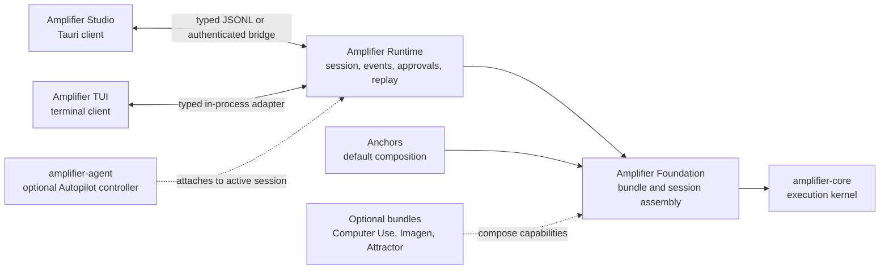

# Runtime peer architecture

Status: accepted direction, incremental migration after Studio 0.1.17.

## Decision

Amplifier Studio and the terminal UI are peer clients of one neutral Amplifier
session runtime. Neither client owns the execution kernel. Studio may use the
existing TUI executable as a compatibility adapter while the UI-free kernel is
extracted, but that adapter is not the target architecture.

The boundaries are deliberately asymmetric:

- `amplifier-core` executes model and tool turns.
- Foundation prepares bundles and creates sessions. It remains mechanism, not
  a desktop product layer.
- Anchors is the opinionated default composition, not a hidden dependency of
  the client.
- the neutral runtime owns durable session identity, event normalization,
  approvals, leases, replay, interruption, and lifecycle.
- Studio and the TUI render the same runtime facts for different interaction
  environments.
- `amplifier-agent` is an optional controller. Autopilot attaches to the
  already-active session; it does not create a replacement session or become
  the persistence layer.

## Migration contract

The preferred executable name is `amplifier-runtime`. During migration Studio
falls back to `amplifier-tui` and labels that path as **TUI compatibility
adapter**. Resolution order is:

1. explicit `AMPLIFIER_STUDIO_RUNTIME_BIN`;
2. `~/.local/bin/amplifier-runtime`;
3. `~/.local/bin/amplifier-tui`;
4. the same two names on `PATH`, neutral runtime first.

The compatibility adapter must retain the current `serve` line protocol. A
neutral runtime replacement is acceptable only when the following behaviors
pass against the same conformance suite:

- boot progress and `session.started`;
- submit, steer, interrupt, approvals, decisions, and effort;
- durable event replay with cursors and idempotent reconnect;
- root and child-agent events with honest identity;
- typed goal-controller state, todo state, context, usage, and cost;
- typed Attractor pipeline events including the DOT source;
- lease, pause/resume, handoff, attach, and audit control records;
- graceful EOF and process shutdown on every desktop OS.

Copying the TUI kernel into Studio is explicitly rejected. It would create a
second runtime implementation and make the clients diverge. The extraction is
an upstream packaging change: move the existing UI-free kernel behind a
neutral package/entrypoint, keep a temporary import shim in the TUI, and run
both client conformance suites against that package.

## Autopilot controller contract

Autopilot is a genuine on/off goal loop. Studio sends a goal for the active
session; the controller evaluates progress, continues only when useful, emits
observable progress/stall/completion records, and stops on user request,
completion, a turn cap, or a safety boundary. The UI must never infer the loop
from a green toggle or a prompt string.

The current `goal.set` / `goal.clear` protocol is the compatibility form of
this contract. The extraction must preserve those semantics while moving
controller ownership out of a client-specific package. An
`amplifier-agent` adapter is complete only when it can attach to the same
session and event ledger; invoking its standalone one-turn engine as a second
session is not equivalent.

## Optional capabilities

Capabilities are compositions with independently verifiable prerequisites:

- Computer Use requires a compatible model and host screen/input permissions.
- Imagen requires the published Imagen bundle, a separately running
  `imagen-mcp`, and separately configured OpenAI or Gemini image credentials.
- Attractor requires typed pipeline events. Studio renders only recorded DOT
  and node/edge state, never a transcript-derived imitation.
- microphone input records a bounded clip, sends it to the runtime host's
  transcription adapter, produces an editable local draft, and never submits
  by itself. The first adapter uses an existing `OPENAI_API_KEY` with
  `gpt-transcribe`; it skips the capability when no key exists and never
  creates or overwrites one. Another provider can replace that adapter without
  changing the composer contract.

Studio may describe a prerequisite as found, missing, or unchecked. It must
not equate a cached bundle name with a working capability.

## Safe increments

1. Keep 0.1.17 as the immutable release baseline and add neutral executable
   discovery plus an explicit compatibility label.
2. Add conformance tests around the existing protocol before extracting code.
3. Publish the neutral runtime package and retain a TUI import/entrypoint shim.
4. Make both Studio and the TUI consume it as peers.
5. Attach `amplifier-agent` as the optional active-session controller.
6. Remove the compatibility adapter only after new-session, resume, approval,
   replay, multi-agent, pipeline, and shutdown acceptance tests pass on macOS
   and Windows, with remote-host tests covering iOS, Android, and web.
